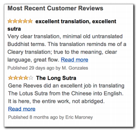
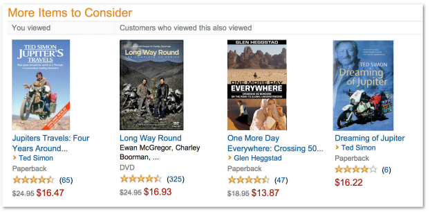
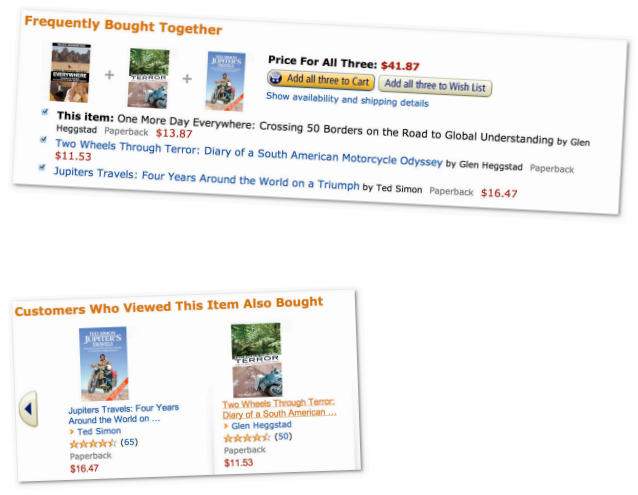
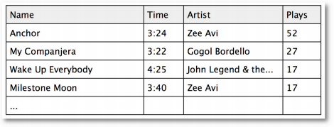

# 第三章：隐式评价和基于物品的过滤算法

原文：http://guidetodatamining.com/chapter-3/

本章会从用户的评价类型开始讨论，包括显式评价（赞一下、踩一脚、五星评价等等）和隐式评价（比如在亚马逊上购买了MP3，我们可以认为他喜欢这个产品）。

内容：

* 显式评价
* 隐式评价
* 哪种评价方式更准确？
* 基于用户的协同过滤
* 基于物品的协同过滤
* 修正的余弦相似度
* Slope One算法
* Slope One的Python实现
* MovieLens数据

第二章中我们学习了协同过滤和推荐系统的基本知识，其中讲述的算法是比较通用的，可以适用于多种数据集。用户使用5到10分的标尺来对不同的物品进行打分，通过计算得到相似的用户。但是，也有迹象表明用户通常不会有效地使用这种度量方式，而更倾向于给出极好或极差的评价，这种做法会使推荐结果变得不可用。这一章我们将继续探讨这个问题，尝试使用高效的方法给出更精确的推荐。

## 显式评价

用户的评价类型可以分为显式评价和隐式评价。显式评价指的是用户明确地给出对物品的评价，最常见的例子是Pandora和YouTube上的“喜欢”和“不喜欢”按钮：

以及亚马逊的星级系统：

## 隐式评价

所谓隐式评价，就是我们不让用户明确给出对物品的评价，而是通过观察他们的行为来获得偏好信息。示例之一是记录用户在纽约时报网上的点击记录。

经过几周的观察之后，我们就可以为用户刻画出一个合理的模型了——她不喜欢体育新闻，但关注科技新闻；如果用户连续看了两篇文章：《快速减肥方法》和《不反弹的减肥方式》，那她很可能正在减肥；如果她点击了iPhone的广告，就表明她或许对这款产品感兴趣。

试想一下，如果我们记录了用户在亚马逊上的操作记录，可以得出一些什么结论。你的首页上可能有这样的内容：

在这个示例中，亚马逊记录了用户的点击操作，因此它会知道浏览了Jupter Travel这本书的用户还浏览了Long Way Round这部DVD，其详细记录了演员伊万环球骑行的旅程。因此，亚马逊就用这些信息来做出“看过还看过”的推荐。

另一种隐式评价是用户的实际购买记录，亚马逊也会用这些记录来进行“买过还买过”、以及“看过此商品的用户还买过”的推荐。

可能你会觉得“买过还买过”应该会给出一些不合理的推荐结果，但事实上它运作得很好。

再来看看iTunes上如何记录用户的行为：

首先，我将一首歌添加到了iTunes，这至少表明我对这首歌是感兴趣的。然后是播放次数，上表中我听了Anchor这首歌52次，说明我很喜欢；而那些只听了一次的歌曲则是我不喜欢的。
