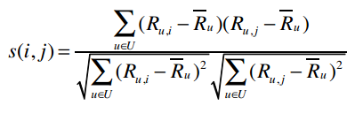
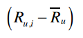
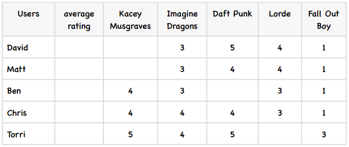
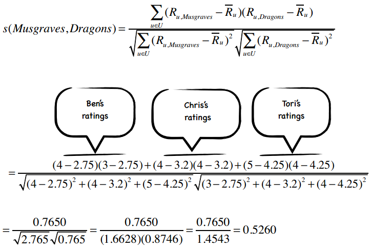

# 第三章：隐式评价和基于物品的过滤算法

原文：http://guidetodatamining.com/chapter-3/

本章会从用户的评价类型开始讨论，包括显式评价（赞一下、踩一脚、五星评价等等）和隐式评价（比如在亚马逊上购买了MP3，我们可以认为他喜欢这个产品）。

内容：

* 显式评价
* 隐式评价
* 哪种评价方式更准确？
* 基于用户的协同过滤
* 基于物品的协同过滤
* 修正的余弦相似度
* Slope One算法
* Slope One的Python实现
* MovieLens数据

第二章中我们学习了协同过滤和推荐系统的基本知识，其中讲述的算法是比较通用的，可以适用于多种数据集。用户使用5到10分的标尺来对不同的物品进行打分，通过计算得到相似的用户。但是，也有迹象表明用户通常不会有效地使用这种度量方式，而更倾向于给出极好或极差的评价，这种做法会使推荐结果变得不可用。这一章我们将继续探讨这个问题，尝试使用高效的方法给出更精确的推荐。

## 显式评价

用户的评价类型可以分为显式评价和隐式评价。显式评价指的是用户明确地给出对物品的评价，最常见的例子是Pandora和YouTube上的“喜欢”和“不喜欢”按钮：


以及亚马逊的星级系统：


## 隐式评价

所谓隐式评价，就是我们不让用户明确给出对物品的评价，而是通过观察他们的行为来获得偏好信息。示例之一是记录用户在纽约时报网上的点击记录。


经过几周的观察之后，我们就可以为用户刻画出一个合理的模型了——她不喜欢体育新闻，但关注科技新闻；如果用户连续看了两篇文章：《快速减肥方法》和《不反弹的减肥方式》，那她很可能正在减肥；如果她点击了iPhone的广告，就表明她或许对这款产品感兴趣。

试想一下，如果我们记录了用户在亚马逊上的操作记录，可以得出一些什么结论。你的首页上可能有这样的内容：


在这个示例中，亚马逊记录了用户的点击操作，因此它会知道浏览了Jupter Travel这本书的用户还浏览了Long Way Round这部DVD，其详细记录了演员伊万环球骑行的旅程。因此，亚马逊就用这些信息来做出“看过还看过”的推荐。

另一种隐式评价是用户的实际购买记录，亚马逊也会用这些记录来进行“买过还买过”、以及“看过此商品的用户还买过”的推荐。


可能你会觉得“买过还买过”应该会给出一些不合理的推荐结果，但事实上它运作得很好。

再来看看iTunes上如何记录用户的行为：


首先，我将一首歌添加到了iTunes，这至少表明我对这首歌是感兴趣的。然后是播放次数，上表中我听了Anchor这首歌52次，说明我很喜欢；而那些只听了一次的歌曲则是我不喜欢的。

**头脑风暴**

> 你觉得让用户对物品进行显式评价会更精确吗？还是说通过观察用户对物品的行为（是否购买或播放次数）才更为准确？


> 显式评价：我叫吉姆，是一个素食主义者。我爱喝葡萄酒，喜欢在森林中漫步，在篝火旁阅读Chekov的书，喜欢观看法国电影，周六会去艺术博物馆逛逛，我还喜欢舒曼的钢琴曲。


> 隐式评价：我们在吉姆的口袋里发现了12打美国蓝带啤酒的收银条，以及冰激淋、披萨和甜甜圈的收银条。还有一些租借DVD的回执，有复仇者联盟、生化危机、拳霸等。

## 显式评价的问题

### 问题1：人们很懒，不愿评价物品

首先，用户很可能不会对物品做出评价。相信各位读者已经在亚马逊上购买了很多商品，就拿我来说，仅过去一个月我就在那里购买了直升机模型、1TB硬盘、USB-SATA转接头、维他命药片、两本Kindle电子书、四本纸质书。一共十件商品，我评价了几件？零件！相信很多人和我是一样的——我们不评价商品，我们只管买。

我喜欢旅行和登山，所以购买了很多登山杖。亚马逊上一些价格实惠的登山杖很耐用。去年我到奥斯汀市参加音乐会，途中碰坏了膝盖，于是到REI专营店买了一根价格昂贵的登山杖。不过这根杖居然在我逛公园时用断了！这根昂贵的登山杖还没有买的10美元的来得结实。放假时，我打算给这件商品写一篇评价，告诫其他购买者。结果呢？我没有写，因为我太懒了。

### 问题2：人们会撒谎，或存有偏见

我们假设有人不像前面说得那么懒，确实去给物品做出评价了，但他有可能会撒谎。这种情况在前文中已经有提到了。用户可能会直接撒谎，给出不正确的评价；或是不置可否，抱有偏见。Ben和他的朋友们去看了一场泰国出的电影，Ben认为这部电影很糟糕，而其他人却觉得很好看，在餐厅里欢快地谈论着。于是，Ben在评价电影时很有可能会抬高它的分数，这样才能表现得合群。

### 问题3：人们不会更新他们的评论

假设我去亚马逊评价了商品——那个1TB的硬盘速度很快也很静音；直升机模型操作起来也很简便，不容易摔坏。所以这两件商品我都给出了5星的评价。但一个月后，那块硬盘坏了，我丢失了所有的电影和音乐；那台直升机模型也突然不再工作了，让我非常扫兴。但是，我不太会返回亚马逊网站对这两件商品的评价做出改动，这样人们依旧认为我是非常喜欢这两件商品的。


再举一个示例，玛丽很乐意在亚马逊上对商品做评价。她十年前给一些儿童类书籍打了很高的分数，近些年又对一些摇滚乐队的专辑给出了评价。从近年的评价看，她和另一位用户珍妮很相似。但是，如果我们把那些儿童书籍推荐给珍妮就显得不合适了。这个例子和上面的有些不同，但的确是个问题。

**头脑风暴**

> 你觉得隐式评价会有什么问题？提示：可以回忆一下你在亚马逊的购买记录。

上文中我给出了一个近期在亚马逊上的购物列表，其中有两样是我买来送给其他人的。为什么这会是一个问题？我再举一些其他的例子。我给我的孩子买了一个壶铃和一本关于健身的书籍；我给我的太太买了一个边境牧羊犬的毛绒玩具，因为我家那只14岁大的狗去世了。通过隐式评价来进行建模，会让你觉得我喜欢壶铃和毛绒玩具。亚马逊的购买记录无法区分这件商品是我买来自己用的还是送人的。贝克也曾给出了相似的例子：


> 对于计算机来说，能够将白色连衣裙和婴儿潮出生的女性关联起来是任务的第一步，然后再对这些用户建立模型。假设我的太太在商店里购买了几件商品：内衣、裤子、连衣裙、皮带等，这些商品都很符合婴儿潮的特点。离开时她想起要为自己16岁大的外甥女买一件生日礼物。由于我们上次看到她时她穿着一件黑色的T恤，上面写满了文字，并自称是一名哥特摇滚妞。于是，我的太太就去买了一根项圈准备送给她。

可以想象，如果我们要为这位用户构建模型，那这根项圈的存在就很有问题了。

再比如一对情侣使用的是同一个Netflix账号。男方喜欢各种爆破场面，女方则喜欢知性类型的电影。如果我们从浏览历史进行挖掘，则会发现一个人会喜欢两种截然不同的影片类型。

前面说到我买了一些书给别人，所以单从购买历史看，同一本书我会购买很多次。这样有两种可能：一是我的书不小心丢了，二是我得了老年痴呆，不记得自己曾读过这些书。而事实是我非常喜欢这些书，因此多买了几本作为礼物来送给别人。所以说，用户的购买记录还是非常值得深究的。

**头脑风暴**

> 我们可以收集到哪些隐式评价呢？
> 网页方面：页面点击、停留时间、重复访问次数、引用率、Hulu上观看视频的次数；
> 音乐播放器：播放的曲目、跳过的曲目、播放次数；
> 这些只是一小部分！

值得注意的是，我们在第二章中学习的算法对于显式评价和隐式评价都是适用的。

## 什么会阻碍你成功？

设想你有一个成熟的在线音乐网站，在构建推荐系统时会遇到什么问题呢？

假设你有一百万个用户，每次推荐需要计算一百万个距离数据。如果我们想在一秒钟里进行多次推荐，那计算量将是巨大的。除非增加服务器的数量，否则系统会变得越来越慢。说得专业一点，通过邻域进行计算的推荐系统，延迟会变得越来越严重。还好，这是有解决办法的。


## 基于用户的协同过滤

目前为止我们描述的都是基于用户的协同过滤算法。我们将一个用户和其他所有用户进行对比，找到相似的人。这种算法有两个弊端：

1. **扩展性** 上文已经提到，随着用户数量的增加，其计算量也会增加。这种算法在只有几千个用户的情况下能够工作得很好，但达到一百万个用户时就会出现瓶颈。
2. **稀疏性** 大多数推荐系统中，物品的数量要远大于用户的数量，因此用户仅仅对一小部分物品进行了评价，这就造成了数据的稀疏性。比如亚马逊有上百万本书，但用户只评论了很少一部分，于是就很难找到两个相似的用户了。

鉴于以上两个局限性，我们不妨考察一下基于物品的协同过滤算法。

## 基于物品的协同过滤

假设我们有一种算法可以计算出两件物品之间的相似度，比如Phoenix专辑和Manners很相似。如果一个用户给Phoenix打了很高的分数，我们就可以向他推荐Manners了。需要注意这两种算法的区别：基于用户的协同过滤是通过计算用户之间的距离找出最相似的用户，并将他评价过的物品推荐给目标用户；而基于物品的协同过滤则是找出最相似的物品，再结合用户的评价来给出推荐结果。

### 能否举个例子？

我们的音乐站点有m个用户和n个乐队，用户会对乐队做出评价，如下表所示：


我们要计算Phoenix和Passion Pit之间的相似度，可以使用蓝色方框中的数据，也就是同时对这两件商品都有过评价的用户。在基于用户的算法中，我们计算的是行与行之间的相似度，而在基于物品的算法中，我们计算的是列与列之间的。


> 基于用户的协同过滤又称为内存型协同过滤，因为我们需要将所有的评价数据都保存在内存中来进行推荐。

> 基于物品的协同过滤也称为基于模型的协同过滤，因为我们不需要保存所有的评价数据，而是通过构建一个物品相似度模型来做推荐。

## 修正的余弦相似度

我们使用余弦相似度来计算两个物品的距离。我们在第二章中提过“分数膨胀”现象，因此我们会从用户的评价中减去他所有评价的均值，这就是修正的余弦相似度。


> 左：我喜欢Phoenix乐队，因此给他们打了5分。我不喜欢Passion，所以给了3分。

> 右：Phoenix很棒，我给4分。Passion Pit太糟糕了，必须给0分！



*U表示同时评价过物品i和j的用户集合*

这个公式来自于一篇影响深远的论文《[基于物品的协同过滤算法](http://www.grouplens.org/papers/pdf/www10_sarwar.pdf)》，由Badrul Sarwar等人合著。



上式表示将用户u对物品i的评价值减去用户u对所有物品的评价均值，从而得到修正后的评分。s(i,j)表示物品i和j的相似度，分子表示将同时评价过物品i和j的用户的修正评分相乘并求和，分母则是对所有的物品的修正评分做一些汇总处理。

为了更好地演示修正的余弦相似度，我们举一个例子。下表是五个学生对五位歌手的评价：



首先，我们计算出每个用户的平均评分，这很简单：


下面，我们计算歌手之间的相似度，从Kacey Musgraves和Imagine Dragons开始。上图中我已经标出了同时评价过这两个歌手的用户，代入到公式中：



所以这两个歌手之间的修正余弦相似度为0.5260，我计算了其他一些歌手之间的相似度，其余的请读者们完成：


### 计算修正余弦相似度的Python代码

```python
# -*- coding: utf-8 -*-

from math import sqrt

users3 = {"David": {"Imagine Dragons": 3, "Daft Punk": 5,
                    "Lorde": 4, "Fall Out Boy": 1},
          "Matt": {"Imagine Dragons": 3, "Daft Punk": 4,
                   "Lorde": 4, "Fall Out Boy": 1},
          "Ben": {"Kacey Musgraves": 4, "Imagine Dragons": 3,
                  "Lorde": 3, "Fall Out Boy": 1},
          "Chris": {"Kacey Musgraves": 4, "Imagine Dragons": 4,
                    "Daft Punk": 4, "Lorde": 3, "Fall Out Boy": 1},
          "Tori": {"Kacey Musgraves": 5, "Imagine Dragons": 4,
                   "Daft Punk": 5, "Fall Out Boy": 3}}


def computeSimilarity(band1, band2, userRatings):
    averages = {}
    for (key, ratings) in userRatings.items():
        averages[key] = (float(sum(ratings.values())) / len(ratings.values()))
    
    num = 0 # 分子
    dem1 = 0 # 分母的第一部分
    dem2 = 0
    for (user, ratings) in userRatings.items():
        if band1 in ratings and band2 in ratings:
            avg = averages[user]
            num += (ratings[band1] - avg) * (ratings[band2] - avg)
            dem1 += (ratings[band1] - avg) ** 2
            dem2 += (ratings[band2] - avg) ** 2
    return num / (sqrt(dem1) * sqrt(dem2))

print computeSimilarity('Kacey Musgraves', 'Lorde', users3)
print computeSimilarity('Imagine Dragons', 'Lorde', users3)
print computeSimilarity('Daft Punk', 'Lorde', users3)
```


