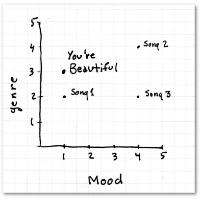

第四章：分类
============

在上几章中我们使用用户对物品的评价来进行推荐，这一章我们将使用物品本身的特征来进行推荐。这也是潘多拉音乐站所使用的方法。

内容：

* 潘多拉推荐系统简介
* 特征值选择的重要性
* 示例：音乐特征值和邻域算法
* 数据标准化
* 修正的标准分数
* Python代码：音乐，特征，以及简单的邻域算法实现
* 一个和体育相关的示例
* 特征值抽取方式一览

## 根据物品特征进行分类

前几章我们讨论了如何使用协同过滤来进行推荐，由于使用的是用户产生的各种数据，因此又称为社会化过滤算法。比如你购买了Phoenix专辑，我们网站上其他购买过这张专辑的用户还会去购买Vampire的专辑，因此会把它推荐给你；我在Netflix上观看了Doctor Who，网站会向我推荐Quantum Leap，用的是同样的原理。我们同时也讨论了协同过滤会遇到的种种问题，包括数据的稀疏性和算法的可扩展性。此外，协同过滤算法倾向于推荐那些已经很流行的物品。试想一个极端的例子：一个新乐队发布了专辑，这张专辑还没有被任何用户评价或购买过，那它将永远不会出现在推荐列表中。

> **这类推荐系统会让流行的物品更为流行，冷门的物品更无人问津。**

> -- Daniel Fleder & Kartik Hosanagar 2009 《推荐系统对商品分类的影响》

这一章我们来看另一种推荐方法。以潘多拉音乐站举例，在这个站点上你可以设立各种音乐频道，只需为这个频道添加一个歌手，潘多拉就会播放和这个歌手风格相类似的歌曲。比如我添加了Phoenix乐队，潘多拉便会播放El Ten Eleven的歌曲。它并没有使用协同过滤，而是通过计算得到这两个歌手的音乐风格是相似的。其实在播放界面上可以看到推荐理由：

“根据你目前告知的信息，我们播放的这首歌曲有着相似的旋律，使用了声响和电音的组合，即兴的吉他伴奏。”在我的Hiromi音乐站上，潘多拉会播放E.S.T.的歌曲，因为“它有着古典爵士乐风，一段高水准的钢琴独奏，轻盈的打击乐，以及有趣的歌曲结构。”

潘多拉网站的推荐系统是基于一个名为音乐基因的项目。他们雇佣了专业的音乐家对歌曲进行分类（提取它们的“基因”）。这些音乐家会接受超过150小时的训练，之后便可用20到30分钟的时间来分析一首歌曲。这些乐曲特征是很专业的：

这些专家要甄别400多种特征，平均每个月会有15000首新歌曲，因此这是一项非常消耗人力的工程。

> 注意：潘多拉的音乐基因项目是商业机密，我不曾了解它的任何信息。下文讲述的是如何构造一个类似的系统。

### 特征值选取的重要性

假设潘多拉会用曲风和情绪作为歌曲特征，分值如下：

* 曲风：乡村1分，爵士2分，摇滚3分，圣歌4分，饶舌5分
* 情绪：悲伤的1分，欢快的2分，热情的3分，愤怒的4分，不确定的5分

比如James Blunt的那首You're Beautiful是悲伤的摇滚乐，用图表来展示它的位置便是：

比如一个叫Tex的用户喜欢You're Beautiful这首歌，我们想要为他推荐歌曲。

我们的歌曲库中有另外三首歌：歌曲1是悲伤的爵士乐；歌曲2是愤怒的圣歌；歌曲3是愤怒的摇滚乐。你会推荐哪一首？

图中歌曲1看起来是最相近的。也许你已经看出了这种算法中的不足，因为不管用何种计算距离的公式，爵士乐和摇滚乐是相近的，悲伤的乐曲和快乐的乐曲是相近的等等。即使调整了分值的分配，也不能解决问题。这就是没有选取好特征值的例子。不过解决的方法也很简单，我们将每种歌曲类型拆分成单独的特征，并对此进行打分：

“乡村音乐”一栏的1分表示完全不是这个乐曲风格，5分则表示很相符。这样一来，评分值就显得有意义了。如果一首歌的“乡村音乐”特征是4分，另一首是5分，那我们可以认为它们是相似的歌曲。

其实这就是潘多拉所使用的特征抽取方法。每个特征都是1到5分的尺度，0.5分为一档。特征会被分到不同的大类中。通过这种方式，潘多拉将每首歌曲都抽象成一个包含400个数值元素的向量，并结合我们之前学过的距离计算公式进行推荐。
