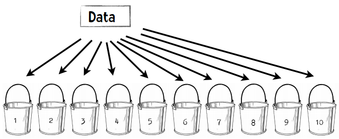
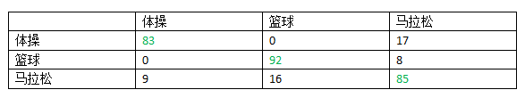

第五章：进一步探索分类
======================

## 效果评估算法和kNN

让我们回到上一章中运动项目的例子。


在那个例子中，我们编写了一个分类器程序，通过运动员的身高和体重来判断她参与的运动项目——体操、田径、篮球等。

上图中的Marissa Coleman，身高6尺1寸，重160磅，我们的分类器可以正确的进行预测：

```python
>>> cl = Classifier('athletesTrainingSet.txt')
>>> cl.classify([73, 160])
'Basketball'
```

对于身高4尺9寸，90磅重的人：

```python
>>> cl.classify([59, 90])
'Gymnastics'
```

当我们构建完一个分类器后，应该问以下问题：

* 分类器的准确度如何？
* 结果理想吗？
* 如何与其它分类器做比较？


### 训练集和测试集

上一章我们一共引入了三个数据集，分别是女运动员、鸢尾花、加仑公里数。我们将这些数据集分为了两个部分，第一部分用来构造分类器，因此称为训练集；另一部分用来评估分类器的结果，因此称为测试集。训练集和测试集在数据挖掘中很常用。

*数据挖掘工程师不会用同一个数据集去训练和测试程序。*

因为如果使用训练集去测试分类器，得到的结果肯定是百分之百准确的。换种说法，在评价一个数据挖掘算法的效果时，如果用来测试的数据集是训练集本身的一个子集，那结果会极大程度趋向于好，所以这种做法不可取。

将数据集拆分成一大一小两个部分的做法就产生了，前者用来训练，后者用来测试。不过，这种做法似乎也有问题：如果分割的时候不凑巧，就会引发异常。比如，若测试集中的篮球运动员恰巧都很矮，她们就会被归为马拉松运动员；如果又矮又轻，则会被归为体操运动员。使用这样的测试集会造成评分结果非常低。相反的情况也有可能出现，使评分结果趋于100%准确。无论哪种情况发生，都不是一种真实的评价。

解决方法之一是将数据集按不同的方式拆分，测试多次，取结果的平均值。比如，我们将数据集拆为均等的两份：


我们可以先用第一部分做训练集，第二部分做测试集，然后再反过来，取两次测试的平均结果。我们还可以将数据集分成三份，用两个部分来做训练集，一个部分来做测试集，迭代三次：

1. 使用Part 1和Part 2训练，使用Part 3测试；
2. 使用Part 1和Part 3训练，使用Part 2测试；
3. 使用Part 2和Part 3训练，使用Part 1测试；

最后取三次测试的平均结果。

在数据挖掘中，通常的做法是将数据集拆分成十份，并按上述方式进行迭代测试。因此这种方式也称为——

### 十折交叉验证

将数据集随机分割成十个等份，每次用9份数据做训练集，1份数据做测试集，如此迭代10次。

我们来看一个示例：假设我有一个分类器能判断某个人是否是篮球运动员。我的数据集包含500个运动员和500个普通人。

**第一步：将数据分成10份**



每个桶中会放50个篮球运动员，50个普通人，一共100人。

**第二步：重复以下步骤10次**

1. 每次迭代我们保留一个桶，比如第一次迭代保留木桶1，第二次保留木桶2。
2. 我们使用剩余的9个桶来训练分类器，比如第一次迭代使用木桶2至10来训练。
3. 我们用刚才保留的一个桶来进行测试，并记录结果，比如：35个篮球运动员分类正确，29个普通人分类正确。

**第三步：合并结果**

我们可以用一张表格来展示结果：


500个篮球运动员中有372个人判断正确，500个普通人中有280个人判断正确，所以我们可以认为1000人中有652个人判断正确，准确率就是65.2%。通过十折交叉验证得到的评价结果肯定会比二折或者三折来得准确，毕竟我们使用了90%的数据进行训练，而非二折验证中的50%。

> 好，既然十折交叉验证效果那么好，我们为何不做一个N折交叉验证？N即数据集中的数据量。

> 如果我们有1000个数据，我们就用999个数据来训练分类器，再用它去判定剩下的一个数据。这样得到的验证效果应该是最好的。


## 留一法

在数据挖掘领域，N折交叉验证又称为留一法。上面已经提到了留一法的优点之一：我们用几乎所有的数据进行训练，然后用一个数据进行测试。留一法的另一个优点是：确定性。

### 什么是确定性？

试想Lucy花了一整周的时间编写了一个分类器。周五的时候她请两位同事（Emily和Li）来对这个分类器进行测试，并给了他们相同的数据集。这两位同事都使用十折交叉验证，结果是：


> Emily：这个分类器的准确率是73.69%，很不错！

> Li：它的准确率只有71.27%。

为什么她们的结果不一样？是某个人计算发生错误了吗？其实不是。在十折交叉验证中，我们需要将数据随机等分成十份，因此Emily和Li的分法很有可能是不一样的。这样一来，她们的训练集和测试集也都不相同了，得到的结果自然不同。即使是同一个人进行检验，如果两次使用了不同的分法，得到的结果也会有差异。因此，十折交叉验证是一种不确定的验证。相反，留一法得到的结果总是相同的，这是它的一个优点。

### 留一法的缺点

最大的缺点是计算时间很长。假设我们有一个包含1000条记录的数据集，使用十折交叉验证需要运行10分钟，而使用留一法则需要16个小时。如果我们的数据集更大，达到百万级，那检验的时间就更长了。


> 我两年后再给你检验结果！

留一法的另一个缺点是分层问题。

### 分层问题

让我们回到运动员分类的例子——判断女运动员参与的项目是篮球、体操、还是田径。在训练分类器的时候，我们会试图让训练集包含全部三种类别。如果我们完全随机分配，训练集中有可能会不包含篮球运动员，在测试的时候就会影响结果。比如说，我们来构建一个包含100个运动员的数据集：从女子NBA网站上获取33名篮球运动员的信息，到Wikipedia上获取33个参加过2012奥运会体操项目的运动员，以及34名田径运动员的信息。这个数据集看起来是这样的：


现在我们来做十折交叉验证。我们按顺序将这些运动员放到10个桶中，所以前三个桶放的都是篮球运动员，第四个桶有篮球运动员也有体操运动员，以此类推。这样一来，没有一个桶能真正代表这个数据集的全貌。最好的方法是将不同类别的运动员按比例分发到各个桶中，这样每个桶都会包含三分之一篮球运动员、三分之一体操运动员、以及三分之一田径运动员。这种做法叫做分层。而在留一法中，所有的测试集都只包含一个数据。所以说，留一法对小数据集是合适的，但大多数情况下我们会选择十折交叉验证。

## 混淆矩阵


目前我们衡量分类器准确率的方式是使用以下公式：正确分类的记录数÷记录总数。有时我们会需要一个更为详细的评价结果，这时就会用到一个称为混淆矩阵的可视化表格。表格的行表示测试用例实际所属的类别，列则表示分类器的判断结果。

混淆矩阵可以帮助我们快速识别出分类器到底在哪些类别上发生了混淆，因此得名。让我们看看运动员的示例，这个数据集中有300人，使用十折交叉验证，其混淆矩阵如下：



可以看到，100个体操运动员中有83人分类正确，17人被错误地分到了马拉松一列；92个篮球运动员分类正确，8人被分到了马拉松；85个马拉松运动员分类正确，9人被分到了体操，16人被分到了篮球。

混淆矩阵的对角线（绿色字体）表示分类正确的人数，因此求得的准确率是：


从混淆矩阵中可以看出分类器的主要问题。在这个示例中，我们的分类器可以很好地区分体操运动员和篮球运动员，而马拉松运动员则比较容易和其他两个类别发生混淆。


> 怎样，是不是觉得混淆矩阵其实并不混淆呢？

## 代码示例

让我们使用加仑公里数这个数据集，格式如下：


我会通过汽车的以下属性来判断它的加仑公里数：汽缸数、排气量、马力、重量、加速度。我将392条数据都存放在mpgData.txt文件中，并用下面这段[Python代码](code/chapter-5/divide.py)将这些数据按层次等分成十份：

```python
# -*- coding: utf-8 -*-

# 将数据等分成十份的示例代码

import random

def buckets(filename, bucketName, separator, classColumn):
    """filename是源文件名
    bucketName是十个目标文件的前缀名
    separator是分隔符，如制表符、逗号等
    classColumn是表示数据所属分类的那一列的序号"""

    # 将数据分为10份
    numberOfBuckets = 10
    data = {}
    # 读取数据，并按分类放置
    with open(filename) as f:
        lines = f.readlines()
    for line in lines:
        if separator != '\t':
            line = line.replace(separator, '\t')
        # 获取分类
        category = line.split()[classColumn]
        data.setdefault(category, [])
        data[category].append(line)
    # 初始化分桶
    buckets = []
    for i in range(numberOfBuckets):
        buckets.append([])       
    # 将各个类别的数据均匀地放置到桶中
    for k in data.keys():
        # 打乱分类顺序
        random.shuffle(data[k])
        bNum = 0
        # 分桶
        for item in data[k]:
            buckets[bNum].append(item)
            bNum = (bNum + 1) % numberOfBuckets

    # 写入文件
    for bNum in range(numberOfBuckets):
        f = open("%s-%02i" % (bucketName, bNum + 1), 'w')
        for item in buckets[bNum]:
            f.write(item)
        f.close()

# 调用示例      
buckets("pimaSmall.txt", 'pimaSmall',',',8)
```

执行这个程序后会生成10个文件：mpgData01、mpgData02等。

**编程实践**

你能否修改上一章的[近邻算法程序](code/chapter-4/nearestNeighborClassifier.py#L188)，让`test`函数能够执行十折交叉验证？输出的结果应该是这样的：


**解决方案**

我们需要进行以下几步：

* 修改初始化方法，只读取九个桶中的数据作为训练集；
* 增加一个方法，从第十个桶中读取测试集；
* 执行十折交叉验证。

下面我们分步来看：

* 初始化方法`__init__`

`__init__`方法的签名会修改成以下形式：

```python
def __init__(self, bucketPrefix, testBucketNumber, dataFormat):
```

每个桶的文件名是mpgData-01、mpgData-02这样的形式，所以`bucketPrefix`就是“mpgData”。`testBucketNumber`是测试集所用的桶，如果是3，则分类器会使用1、2、4-9的桶进行训练。`dataFormat`用来指定数据集的格式，如：

```
class    num    num    num    num    num    comment
```

意味着第一列是所属分类，后五列是特征值，最后一列是备注信息。

以下是初始化方法的示例代码：

```python
class Classifier:

    def __init__(self, bucketPrefix, testBucketNumber, dataFormat):
        """该分类器程序将从bucketPrefix指定的一系列文件中读取数据，
        并留出testBucketNumber指定的桶来做测试集，其余的做训练集。
        dataFormat用来表示数据的格式，如：
        "class    num    num    num    num    num    comment"
	"""
   
        self.medianAndDeviation = []
        
        # 从文件中读取文件
 
        self.format = dataFormat.strip().split('\t')
        self.data = []
        # 用1-10来标记桶
        for i in range(1, 11):
            # 判断该桶是否包含在训练集中
            if i != testBucketNumber:
                filename = "%s-%02i" % (bucketPrefix, i)
                f = open(filename)
                lines = f.readlines()
                f.close()
                for line in lines[1:]:
                    fields = line.strip().split('\t')
                    ignore = []
                    vector = []
                    for i in range(len(fields)):
                        if self.format[i] == 'num':
                            vector.append(float(fields[i]))
                        elif self.format[i] == 'comment':
                            ignore.append(fields[i])
                        elif self.format[i] == 'class':
                            classification = fields[i]
                    self.data.append((classification, vector, ignore))
        self.rawData = list(self.data)
        # 获取特征向量的长度
        self.vlen = len(self.data[0][1])
        # 标准化数据
        for i in range(self.vlen):
            self.normalizeColumn(i)
```

* testBucket方法

下面的方法会使用一个桶的数据进行测试：

```python
def testBucket(self, bucketPrefix, bucketNumber):
	"""读取bucketPrefix-bucketNumber所指定的文件作为测试集"""
	
	filename = "%s-%02i" % (bucketPrefix, bucketNumber)
	f = open(filename)
	lines = f.readlines()
	totals = {}
	f.close()
	for line in lines:
		data = line.strip().split('\t')
		vector = []
		classInColumn = -1
		for i in range(len(self.format)):
			  if self.format[i] == 'num':
				  vector.append(float(data[i]))
			  elif self.format[i] == 'class':
				  classInColumn = i
		theRealClass = data[classInColumn]
		classifiedAs = self.classify(vector)
		totals.setdefault(theRealClass, {})
		totals[theRealClass].setdefault(classifiedAs, 0)
		totals[theRealClass][classifiedAs] += 1
	return totals
```

比如说bucketPrefix是mpgData，bucketNumber是3，那么程序会从mpgData-03中读取内容，作为测试集。这个方法会返回如下形式的结果：

```python
{'35': {'35': 1, '20': 1, '30': 1},
 '40': {'30': 1},
 '30': {'35': 3, '30': 1, '45': 1, '25': 1},
 '15': {'20': 3, '15': 4, '10': 1},
 '10': {'15': 1},
 '20': {'15': 2, '20': 4, '30': 2, '25': 1},
 '25': {'30': 5, '25': 3}}
```

这个字段的键表示真实类别。如第一行的35表示该行数据的真实类别是35加仑公里。这个键又对应一个字典，这个字典表示的是分类器所判断的类别，如：

```
'15': {'20': 3, '15': 4, '10': 1},
```

其中的3表示有3条记录真实类别是15加仑公里，但被分类到了20加仑公里；4表示分类正确的记录数；1表示被分到10加仑公里的记录数。

* 执行十折交叉验证

最后我们需要编写一段程序来执行十折交叉验证，也就是说要用不同的训练集和测试集来构建10个分类器。

```python
def tenfold(bucketPrefix, dataFormat):
    results = {}
    for i in range(1, 11):
        c = Classifier(bucketPrefix, i, dataFormat)
        t = c.testBucket(bucketPrefix, i)
        for (key, value) in t.items():
            results.setdefault(key, {})
            for (ckey, cvalue) in value.items():
                results[key].setdefault(ckey, 0)
                results[key][ckey] += cvalue
                
    # 输出结果
    categories = list(results.keys())
    categories.sort()
    print(   "\n       Classified as: ")
    header =    "        "
    subheader = "      +"
    for category in categories:
        header += category + "   "
        subheader += "----+"
    print (header)
    print (subheader)
    total = 0.0
    correct = 0.0
    for category in categories:
        row = category + "    |"
        for c2 in categories:
            if c2 in results[category]:
                count = results[category][c2]
            else:
                count = 0
            row += " %2i |" % count
            total += count
            if c2 == category:
                correct += count
        print(row)
    print(subheader)
    print("\n%5.3f percent correct" %((correct * 100) / total))
    print("total of %i instances" % total)

# 调用方法
tenfold("mpgData/mpgData",        "class	num	num	num	num	num	comment")
```

执行结果如下：

```
       Classified as: 
        10   15   20   25   30   35   40   45   
      +----+----+----+----+----+----+----+----+
10    |  3 | 10 |  0 |  0 |  0 |  0 |  0 |  0 |
15    |  3 | 68 | 14 |  1 |  0 |  0 |  0 |  0 |
20    |  0 | 14 | 66 |  9 |  5 |  1 |  1 |  0 |
25    |  0 |  1 | 14 | 35 | 21 |  6 |  1 |  1 |
30    |  0 |  1 |  3 | 17 | 21 | 14 |  5 |  2 |
35    |  0 |  0 |  2 |  8 |  9 | 14 |  4 |  1 |
40    |  0 |  0 |  1 |  0 |  5 |  5 |  0 |  0 |
45    |  0 |  0 |  0 |  2 |  1 |  1 |  0 |  2 |
      +----+----+----+----+----+----+----+----+

53.316 percent correct
total of 392 instances
```

可以在这里下载[代码](code/chapter-5/crossValidation.py)和[数据集](code/chapter-5/mpgData.zip)。
