第五章：概率和朴素贝叶斯
========================

## 朴素贝叶斯

还是让我们回到运动员的例子。如果我问你Brittney Griner的运动项目是什么，她有6尺8寸高，207磅重，你会说“篮球”；我再问你对此分类的准确度有多少信心，你会回答“非常有信心”。

我再问你Heather Zurich，6尺1寸高，重176磅，你可能就不能确定地说她是打篮球的了，至少不会像之前判定Brittney那样肯定。因为从Heather的身高体重来看她也有可能是跑马拉松的。

最后，我再问你Yumiko Hara的运动项目，她5尺4寸高，95磅重，你也许会说她是跳体操的，但也不太敢肯定，因为有些马拉松运动员也是类似的身高体重。


使用近邻算法时，我们很难对分类结果的置信度进行量化。但如果使用的是基于概率的分类算法——贝叶斯算法——那就可以给出分类结果的可能性了：这名运动员有80%的几率是篮球运动员；这位病人有40%的几率患有糖尿病；拉斯克鲁塞斯24小时内有雨的概率是10%。

近邻算法又称为**被动学习**算法。这种算法只是将训练集的数据保存起来，在收到测试数据时才会进行计算。如果我们有10万首音乐，那每进行一次分类，都需要遍历这10万条记录才行。


贝叶斯算法则是一种**主动学习**算法。它会根据训练集构建起一个模型，并用这个模型来对新的记录进行分类，因此速度会快很多。


所以说，贝叶斯算法的两个优点即：能够给出分类结果的置信度；以及它是一种主动学习算法。

### 概率

相信大多数人对概率并不陌生。比如投掷一个硬币，正面出现的概率是50%；掷骰子，出现1点的概率是16.7%；从一群19岁的青少年中随机挑出一个，让你说出她是女生的可能性，你会回答50%。以上这些我们用符号P(h)来表示，即事件h发生的概率：

* 投掷硬币：P(正面) = 0.5
* 掷骰子：P(1) = 1/6
* 青少年：P(女生) = 0.5

如果我再告诉你一些额外的信息，比如这群19岁的青少年都是弗兰科学院建筑专业的学生，于是你到Google上搜索后发现这所大学的女生占86%，这时你就会改变你的答案——女生的可能性是86%。

这一情形我们用P(h|D)来表示，即D条件下事件h发生的概率。比如：

P(女生|弗兰克学院的学生) = 0.86

计算的公式是：

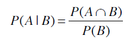

再举一个例子，下表是一些人使用笔记本电脑和手机的品牌：

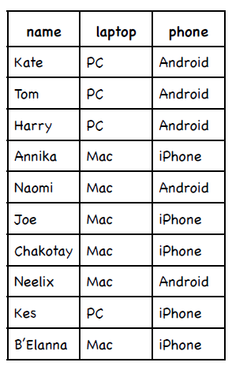

使用iPhone的概率是多少？


如果已知这个人使用的是Mac笔记本，那他使用iPhone的概率是？

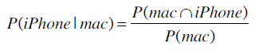

首先计算出同时使用Mac和iPhone的概率：

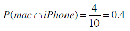

使用Mac的概率则是：

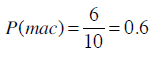

从而计算得到Mac用户中使用iPhone的概率：

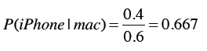

以上是正规的解法，不过为了简单起见，我们可以直接通过计数得到：


**练习**

iPhone用户中使用Mac的概率是？


**术语**

P(h)表示事件h发生的概率，称为h的**先验概率**。在我们进行任何计算之前就已经得知人们使用Mac的概率是0.6。计算之后我们可能会得知使用Mac的人同时会使用iPhone。

P(h|d)称为**后验概率**，表示在观察了数据集d之后，h事件发生的概率是多少。比如说，我们在观察了使用iPhone的用户后可以得出他们使用Mac的概率是多少。后验概率又称为**条件概率**。

在构建一个贝叶斯分类器前，我们还需要两个概率：P(D)和P(D|h)，请看下面的示例。

## 微软购物车

你听说过微软的智能购物车吗？没错，他们真有这样的产品。这个产品是微软和一个名为Chaotic Moon的公司合作开发的。这家公司的标语是“我们比你聪明，我们比你有创造力。”你可以会觉得这样的标语有些狂妄自大，这里暂且不谈。这种购物车由以下几个部分组成：Windows 8平板电脑、Kinect体感设备、蓝牙耳机（购物车可以和你说话）、以及电动装置（购物车可以跟着你走）。

你走进一家超市，持有一张会员卡，智能购物车会识别出你，它会记录你的购物记录（当然也包括其他人的）。


智能购物车也会显示广告（比如日本的Sensha绿茶），不过它只会向那些有可能购买此物品的用户进行展示。

以下是一些数据示例：

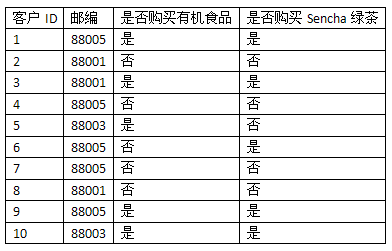

**P(D)**表示从训练集数据中计算得到的概率，比如上表中邮编为88005的概率是：

P(88005) = 0.5

**P(D|h)**表示在一定条件下的观察结果。比如说购买过Sencha绿茶的人中邮编为88005的概率为：

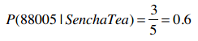

**练习**

没有买Sencha的人中邮编为88005的概率是？


*上式中的“┐”表示取反*

邮编为88001的概率是？

P(88001) = 0.3

购买了Sencha的人中邮编为88001的概率？


没有购买Sencha的人中邮编为88001的概率？


## 贝叶斯法则

贝叶斯法则描述了P(h)、P(h|D)、P(D)、以及P(D|h)这四个概率之间的关系：


这个公式是贝叶斯方法论的基石。在数据挖掘中，我们通常会使用这个公式去判别不同事件之间的关系。我们可以计算得到在某些条件下这位运动员是从事体操、马拉松、还是篮球项目的；也可以计算得到某些条件下这位客户是否会购买Sencha绿茶等。我们会通过计算不同事件的概率来得出结论。

比如说我们要决定是否给一位客户展示Sencha绿茶的广告，已知他所在的地区邮编是88005。我们有两个相反的假设：

* 这位用户会购买Sencha绿茶的概率，即：P(购买|88005)；
* 不会购买的概率：P(┐购买|88005)。

假设我们计算得到P(购买|88005) = 0.6，而P(┐购买|88005) = 0.4，则可以认为用户会购买，从而显示相应的广告。

再比如我们要为一家销售电子产品的公司发送宣传邮件，共有笔记本、台式机、平板电脑三种产品。我们需要根据目标用户的类型来分别派送这三种宣传邮件。比如我们有一位居住在88005地区的女士，她的女儿在读大学，并居住在家中，而且她还会参加瑜伽课程。那我应该派发哪种邮件呢？

让我们用D来表示这位客户的特征：

* 居住在88005地区
* 有一个正在读大学的女儿
* 练习瑜伽

因此我们需要计算以下三个概率：

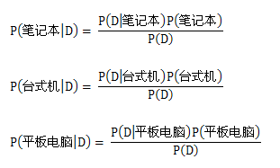

并选择概率最大的结果。

再抽象一点，如果我们有h<sub>1</sub>, h<sub>2</sub>, ...h<sub>n</sub>等事件，它们就相当于不同的类别（篮球、体操、或是有没有患糖尿病等）。

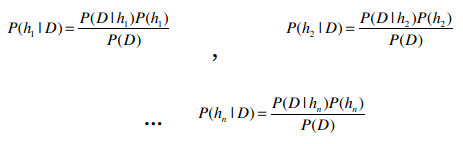

在计算出以上这些概率后，选取最大的结果，就能用作分类了。这种方法叫最大后验估计，记为h<sub>MAP</sub>。


我们可以用以下公式来表示最大后验估计：


H表示所有的事件，所以h∈H表示“对于集合中的每一个事件”。整个公式的含义就是：对于集合中的每一个事件，计算出P(h|D)的值，并取最大的结果。使用贝叶斯法则进行替换：


所以我们需要计算的就是以下这个部分：


可以发现对于所有的事件，公式中的分母都是P(D)，因此即便只计算P(D|h)P(h)，也可以判断出最大的结果。那么这个公式就可以简化为：


作为演示，我们选取Tom M. Mitchell《机器学习》中的例子。Tom是卡耐基梅隆大学机器学习部的首席，也是非常友好的一个人。这个例子是通过一次血液检验来判断某人是否患有某种癌症。已知这种癌症在美国的感染率是0.8%。血液检验的结果有阳性和阴性两种，且存在准确性的问题：如果这个人患有癌症，则有98%的几率测出阳性；如果他没有癌症，会有97%的几率测出阴性。

我们来尝试将这些描述语言用公式来表示：

* 美国有0.8%的人患有这种癌症：P(癌症) = 0.008
* 99.2%的人没有患有这种癌症：P(┐癌症) = 0.992
* 对于患有癌症的人，他的血液检测结果返回阳性的概率是98%：P(阳性|癌症) = 0.98
* 对于患有癌症的人，检测结果返回阴性的概率是2%：P(阴性|癌症) = 0.02
* 对于没有癌症的人，返回阴性的概率是97%：P(阴性|┐癌症) = 0.97
* 对于没有癌症的人，返回阳性的概率是3%：P(阳性|┐癌症) = 0.03


Ann到医院做了血液检测，呈阳性。初看结果并不乐观，毕竟这种血液检测的准确率高达98%。那让我们用贝叶斯法则来计算看看：

* P(阳性|癌症)P(癌症) = 0.98 * 0.008 = 0.0078
* P(阳性|┐癌症)P(┐癌症) = 0.03 * 0.992 = 0.0298

分类的结果是她不会患有癌症。

如果想得到确切的概率，我们可以使用标准化的方法：


可以看到，血液检测为阳性的人患有这种癌症的概率是21%。


可能你会觉得这并不合情理，毕竟血液检测的准确率有98%，而结果却说Ann很可能并没有这种癌症。事实上，很多人都会有这样的 疑问。

我来说明一下为什么会是这样的结果。很多人只看到了血液检测的准确率是98%，但没有考虑到全美只有0.8%的人患有这种癌症。假设我们给一个有着一百万人口的城市做血液检测，也就是说其中有8,000人患有癌症，992,000人没有。首先，对于那8,000个癌症病人，有7,840个人的血液检测结果会呈阳性，160人会呈阴性。对于992,000人，有962,240人会呈阴性，30,000人呈阳性。将这些数字总结到下表中：


Ann的测试结果呈阳性，从上表看阳性中有30,000人其实是健康的，只有7,840人确实患有癌症，所以我们才会认为Ann很有可能是健康的。

> 还是没弄明白？没关系，在接触了更多练习后就会慢慢理解了。

## 为什么我们需要贝叶斯法则？

首先回顾一下贝叶斯公式：


再看看微软购物车的数据：


比如，我们为居住在邮编为88005地区的客户设置两个事件：买或不买Sencha绿茶，即：

P(h<sub>1</sub>|D) = P(买绿茶|88005)

P(h<sub>2</sub>|D) = P(┐买绿茶|88005)

你也许会问，这两个概率我们都可以直接从数据中计算得到，为什么还要计算下面这个公式呢？


那是因为在现实问题中要计算P(h|D)往往是很困难的。

以上一节中的医学示例来说，我们想要根据血液测试结果来判断该人是否患有癌症：

P(癌症|阳性) ≈ P(阳性|癌症)P(癌症)

P(┐癌症|阳性) ≈ P(阳性|┐癌症)P(┐癌症)

上面两个式子中，我们更容易计算约等号右边的结果。比如，要计算P(阳性|癌症)，我们可以对一部分已经确诊有癌症的人做血液测试；计算P(阳性|┐癌症)时则可对确定健康的人做测试。而P(癌症)则可直接从政府公布的官方数据中获得，P(┐癌症)更是简单的1 - P(癌症)。

但若要计算P(癌症|阳性）的话就非常有挑战性了，也就是计算出整个人群中血液测试结果呈阳性且确诊为癌症患者的概率。如果采用抽样法，对1000个人进行抽样测试，只有8个人患有这种癌症，这样得出的结果显然不具有代表性，除非进一步加大抽样数量。而贝叶斯法则提供了更为简便的方法。

### 朴素贝叶斯

很多时候我们会用到不止一个前提条件，比如判断一个人是否会购买Sencha绿茶时可以用到顾客所在地以及是否买过有机食品这两个条件。计算这样的概率时只需将各个条件概率相乘即可：

P(买绿茶|88005 & 买有机食品) = P(88005|买绿茶)P(买有机食品|买绿茶)P(买绿茶) = 0.6 * 0.8 * 0.5 = 0.24

P(┐买绿茶|88005 & 买有机食品) = P(88005|┐买绿茶)P(买有机食品|┐买绿茶)P(┐买绿茶) = 0.4 * 0.25 * 0.5 = 0.05

所以得到的结论是居住在88005地区且买过有机食品的客户更有可能购买Sencha绿茶。这样就让我们在智能购物车上显示广告吧！

以下是史提芬贝克对智能购物车的评价：

> 这种购物车的使用体验是：你取走一辆购物车，刷了会员卡，屏幕上会显示一份购物列表，里面的内容都是基于你平时的购物习惯进行推荐的，牛奶、鸡蛋、西葫芦等等。智能系统会提示出购买这些物品的最佳路径。另外，它还允许你修改列表中的商品，比如你可以让它不要再提示菜花和盐焗花生。Accenture的研究表明，人们在购物时会忘记11%的原本打算购买的商品，如果有了这样的智能购物车，就可以省去客户的来回路程，也能为超市增加销量。

## i100、i500健康手环

现在我们要为iHealth公司销售健康手环产品，从而和Nike Fuel、Fitbit Flex竞争。iHealth新出产了两件商品：i100和i500：


**iHealth 100**

能够监测心率，使用GPS导航（从而计算每小时运动公里数等），带WiFi无线，可随时上传数据到iHealth网站上。


**iHealth 500**

除了提供i100的功能外，还能监测血液含氧量等指标，且提供免费的3G网络连接到iHealth网站。

这些产品通过网络平台销售，所以iHealth雇佣我们开发一套推荐系统。我通过让购买的用户填写调查问卷来收集数据，每个问题都对应一个特征。比如，我们会问客户为什么要开始运动，有三个选项：健康（health）、外表（appearance）、两者皆是（both）；我们会问他目前的运动水平：很少运动（sedentary）、一般（moderate）、经常运动（active）；我们会问他对健身的热情是高（aggressive）还是一般（moderate）；最后，我们会问他是否适应使用高科技产品。整理后的数据如下：

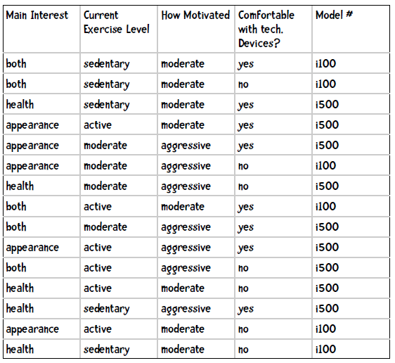

**实践**

已知一位客户的运动目的是健康、当前水平是中等、热情一般、能适应高科技产品，请用朴素贝叶斯来推荐手环型号。

我们需要计算以下两个概率，并选取较大的结果：

```
P(i100|健康，中等水平、热情一般，适应）
P(i500|健康，中等水平，热情一般，适应）
```

我们先来看第一个概率：

```
P(i100|健康，中等水平、热情一般，适应） = P(健康|i100)P(中等水平|i100)P(热情一般|i100)P(适应|i100)
```

其中：

```
P(健康|i100) = 1/6
P(中等水平|i100) = 1/6
P(热情一般|i100) = 5/6
P(适应|i100) = 2/6
P(i100) = 6/15
```

因此：

```
P(i100|满足条件) = 0.167 * 0.167 * 0.833 * 0.333 * 0.4 = 0.00309
```

再计算另一个模型的概率：

```
P(i500|满足条件) = P(健康|i500)P(中等水平|i500)P(热情一般|i500)P(适应|i500)
    = 4/9 * 3/9 * 3/9 * 6/9 * 9/15
    = 0.444 * 0.333 * 0.333 * 0.667 * 0.6
    = 0.01975
```

## 使用Python编写朴素贝叶斯分类器

上例的数据格式如下：

```
both	sedentary	moderate	yes	i100
both	sedentary	moderate	no	i100
health	sedentary	moderate	yes	i500
appearance	active	moderate	yes	i500
appearance	moderate	aggressive	yes	i500
appearance	moderate	aggressive	no	i100
health	moderate	aggressive	no	i500
both	active	moderate	yes	i100
both	moderate	aggressive	yes	i500
appearance	active	aggressive	yes	i500
both	active	aggressive	no	i500
health	active	moderate	no	i500
health	sedentary	aggressive	yes	i500
appearance	active	moderate	no	i100
health	sedentary	moderate	no	i100
```

虽然这个这个例子中只有15条数据，但是我们还是保留十折交叉验证的过程，以便用于更大的数据集。十折交叉验证要求数据集等分成10份，这个例子中我们简单地将15条数据全部放到一个桶里，其它桶留空。

朴素贝叶斯分类器包含两个部分：训练和分类。

### 训练

训练的输出结果应该是：

* 先验概率，如P(i100) = 0.4；
* 条件概率，如P(健康|i100) = 0.167

我们使用如下代码表示先验概率：

```python
self.prior = {'i500': 0.6, 'i100': 0.4}
```

条件概率的表示有些复杂，用嵌套的字典来实现：

```python
{'i500': {1: {'appearance': 0.3333333333333333, 'health': 0.4444444444444444,
              'both': 0.2222222222222222},
          2: {'active': 0.4444444444444444, 'sedentary': 0.2222222222222222,
	      'moderate': 0.3333333333333333},
	  3: {'aggressive': 0.6666666666666666, 'moderate': 0.3333333333333333},
	  4: {'yes': 0.6666666666666666, 'no': 0.3333333333333333}},
 'i100': {1: {'both': 0.5, 'health': 0.16666666666666666, 
              'appearance': 0.3333333333333333},
	  2: {'active': 0.3333333333333333, 'sedentary': 0.5,
	      'moderate': 0.16666666666666666},
	  3: {'aggressive': 0.16666666666666666, 'moderate': 0.8333333333333334},
	  4: {'yes': 0.3333333333333333, 'no': 0.6666666666666666}}}
```

1、2、3、4表示第几列，所以第一行可以解释为购买i500的顾客中运动目的是外表的概率是0.333。

首先我们要来进行计数，比如以下几行数据：

```
both	sedentary	moderate	yes	i100
both	sedentary	moderate	no	i100
health	sedentary	moderate	yes	i500
appearance	active	moderate	yes	i500
```

我们用字典来统计每个模型的次数，变量名为classes，逐行扫描后的结果是：

```python
# 第一行
{'i100': 1}

# 第二行
{'i100': 2}

# 第三行
{'i500': 1, 'i100': 2}

# 全部
{'i500': 9, 'i100': 6}
```

要获取模型的先验概率，只要将计数结果除以总数就可以了。

计算后验概率也需要计数，变量名为counts。这个字典较为复杂，如扫完第一行第一列的结果是：

```python
{'i100': {1: {'both': 1}}
```

处理完所有数据后的计数结果是：

```python
{'i500': {1: {'appearance': 3, 'health': 4, 'both': 2},
          2: {'active': 4, 'sedentary': 2, 'moderate': 3},
	  3: {'aggressive': 6, 'moderate': 3},
	  4: {'yes': 6, 'no': 3}},
 'i100': {1: {'both': 3, 'health': 1, 'appearance': 2}, 
          2: {'active': 2, 'sedentary': 3, 'moderate': 1},
	  3: {'aggressive': 1, 'moderate': 5},
	  4: {'yes': 2, 'no': 4}}}
```

计算概率时，只需将计数除以该模型的总数就可以了：

P(外表|i100) = 2 / 6 = 0.333

以下是训练用的Python代码：

```python
class Classifier:

    def __init__(self, bucketPrefix, testBucketNumber, dataFormat):
        """bucketPrefix 分桶数据集文件前缀
	testBucketNumber 测试桶编号
	dataFormat 数据格式，形如：attr attr attr attr class
        """
   
        total = 0
        classes = {}
        counts = {}
        
        # 从文件中读取数据
        self.format = dataFormat.strip().split('\t')
        self.prior = {}
        self.conditional = {}
        # 遍历十个桶
        for i in range(1, 11):
            # 跳过测试桶
            if i != testBucketNumber:
                filename = "%s-%02i" % (bucketPrefix, i)
                f = open(filename)
                lines = f.readlines()
                f.close()
                for line in lines:
                    fields = line.strip().split('\t')
                    ignore = []
                    vector = []
                    for i in range(len(fields)):
                        if self.format[i] == 'num':
                            vector.append(float(fields[i]))
                        elif self.format[i] == 'attr':
                            vector.append(fields[i])                           
                        elif self.format[i] == 'comment':
                            ignore.append(fields[i])
                        elif self.format[i] == 'class':
                            category = fields[i]
                    # 处理该条记录
                    total += 1
                    classes.setdefault(category, 0)
                    counts.setdefault(category, {})
                    classes[category] += 1
                    # 处理各个属性
                    col = 0
                    for columnValue in vector:
                        col += 1
                        counts[category].setdefault(col, {})
                        counts[category][col].setdefault(columnValue, 0)
                        counts[category][col][columnValue] += 1
        
        # 计数结束，开始计算概率

        # 计算先验概率P(h)
        for (category, count) in classes.items():
            self.prior[category] = count / total

        # 计算条件概率P(h|D)
        for (category, columns) in counts.items():
              self.conditional.setdefault(category, {})
              for (col, valueCounts) in columns.items():
                  self.conditional[category].setdefault(col, {})
                  for (attrValue, count) in valueCounts.items():
                      self.conditional[category][col][attrValue] = (
                          count / classes[category])
        self.tmp =  counts
```

### 分类

分类函数会这样使用：

```python
c.classify(['health', 'moderate', 'moderate', 'yes'])
```

我们需要计算：


```python
    def classify(self, itemVector):
        ""返回itemVector所属类别"""
        results = []
        for (category, prior) in self.prior.items():
            prob = prior
            col = 1
            for attrValue in itemVector:
                if not attrValue in self.conditional[category][col]:
                    # 属性不存在，返回0概率
                    prob = 0
                else:
                    prob = prob * self.conditional[category][col][attrValue]
                col += 1
            results.append((prob, category))
        # 返回概率最高的结果
        return(max(results)[1])
```

让我们测试一下：

```python
>>> c = Classifier('iHealth/i', 10, 'attr\tattr\tattr\tattr\tclass')
>>> c.classify(['health' 'moderate', 'moderate', 'yes'])
i500
```


