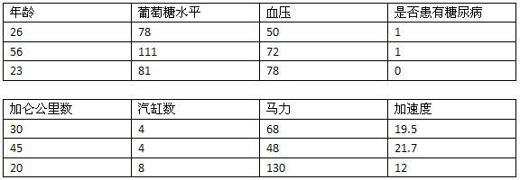

第七章：朴素贝叶斯和文本数据
============================

原文：http://guidetodatamining.com/chapter-7/

## 非结构化文本的分类算法

在前几个章节中，我们学习了如何使用人们对物品的评价（五星、顶和踩）来进行推荐；还使用了他们的隐式评价——买过什么，点击过什么；我们利用特征来进行分类，如身高、体重、对法案的投票等。这些数据有一个共性——能用表格来展现：

