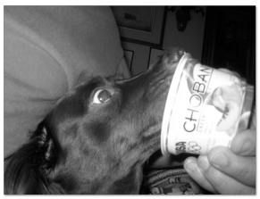

第七章：朴素贝叶斯和文本数据
============================

原文：http://guidetodatamining.com/chapter-7/

## 非结构化文本的分类算法

在前几个章节中，我们学习了如何使用人们对物品的评价（五星、顶和踩）来进行推荐；还使用了他们的隐式评价——买过什么，点击过什么；我们利用特征来进行分类，如身高、体重、对法案的投票等。这些数据有一个共性——能用表格来展现：

因此这类数据我们称为“结构化数据”——数据集中的每条数据（上表中的一行）由多个特征进行描述（上表中的列）。而非结构化的数据指的是诸如电子邮件文本、推特信息、博客、新闻等。这些数据至少第一眼看起来是无法用一张表格来展现的。

举个例子，我们想从推特信息中获取用户对各种电影的评价：

可以看到，Andy Gavin喜欢看地心引力，因为他的消息中有“不寒而栗”、“演的太棒了”之类的文本。而Debra Murphy则不太喜欢这部电影，因为她说“还是省下看这部电影的钱吧”。如果有人说“我太想看这部电影了，都兴奋坏了！”，我们可以看出她是喜欢这部电影的，即使信息中有“坏”这个字。

我在逛超市时看到一种叫Chobani的酸奶，名字挺有趣的，但真的好吃吗？于是我掏出iPhone，谷歌了一把，看到一篇名为“女人不能只吃面包”的博客：

> **无糖酸奶品评**

> 你喝过Chobani酸奶吗？如果没有，就赶紧拿起钥匙出门去买吧！虽然它是脱脂原味的，但喝起来和酸奶的口感很像，致使我每次喝都有负罪感，因为这分明就是在喝全脂酸奶啊！原味的感觉很酸很够味，你也可以尝试一下蜂蜜口味的。我承认，虽然我在减肥期间不该吃蜂蜜的，但如果我有一天心情很糟想吃甜食，我就会在原味酸奶里舀一勺蜂蜜，太值得了！至于那些水果味的，应该都有糖分在里面，但其实酸奶本身就已经很美味了，水果只是点缀。如果你家附近没有Chobani，也可以试试Fage，同样好吃。

> 虽然需要花上一美元不到，而且还会增加20卡路里，但还是很值得的，毕竟我已经一下午没吃东西了！

> *http://womandoesnotliveonbreadalone.blogspot.com/2009/03/sugar-free-yogurt-reviews.html*

这是一篇正面评价吗？从第二句就可以看出，作者非常鼓励我去买。她还用了“够味”、“美味”等词汇，这些都是正面的评价。所以，让我先去吃会儿……

