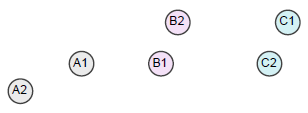
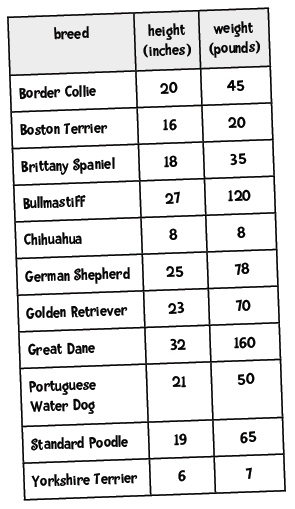
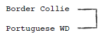
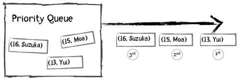

第八章：聚类
============

原文：http://guidetodatamining.com/chapter-8/

前几章我们学习了如何构建分类系统，使用的是已经标记好类别的数据集进行训练：


训练完成后我们就可以用来预测了：这个人看起来像是篮球运动员，那个人可能是练体操的；这个人三年内不会患有糖尿病。

可以看到，分类器在训练阶段就已经知道各个类别的名称了。那如果我们不知道呢？如何构建一个能够自动对数据进行分组的系统？比如有1000人，每人有20个特征，我想把这些人分为若干个组。


这个过程叫做聚类：通过物品特征来计算距离，并自动分类到不同的群集或组中。有两种聚类算法比较常用：

**k-means聚类算法**

我们会事先告诉这个算法要将数据分成几个组，比如“请把这1000个人分成5个组”，“将这些网页分成15个组”。这种方法就叫k-means，我们会在后面的章节讨论。

## 层次聚类法

对于层次聚类法，我们不需要预先指定分类的数量，这个算方法会将每条数据都当作是一个分类，每次迭代的时候合并距离最近的两个分类，直到剩下一个分类为止。因此聚类的结果是：顶层有一个大分类，这个分类下有两个子分类，每个子分类下又有两个子分类，依此类推，层次聚类也因此得命。


在合并的时候我们会计算两个分类之间的距离，可以采用不同的方法。如下图中的A、B、C三个分类，我们应该将哪两个分类合并起来呢？



### 单链聚类

在单链聚类中，分类之间的距离由两个分类相距最近的两个元素决定。如上图中分类A和分类B的距离由A1和B1的距离决定，因为这个距离小于A1到B2、A2到B1的距离。这样一来我们会将A和B进行合并。

### 全链聚类

在全链聚类中，分类之间的距离由两个分类相距最远的两个元素决定。因此上图中分类A和B的距离是A2到B2的距离，最后会将分类B和C进行合并。

### 平均链接聚类

在这种聚类方法中，我们通过计算分类之间两两元素的平均距离来判断分类之间的距离，因此上图中会将分类B和C进行合并。


> 下面让我们用单链聚类法举个例子吧！

我们来用狗的高度和重量来进行聚类：




> 在计算距离前我们是不是忘了做件事？


> 标准化！我们先将这些数据转换为修正的标准分。


然后我们计算欧几里德距离，图中高亮了一些最短距离：


根据下面的图表，你能看出哪两个品种的距离最近吗？


> 如果你看出是Border Collie和Portuguese Water Dog最近，那就对了！

**计算过程**

第一步：我们找到距离最近的两个元素，对他们进行聚类：



第二步：再找出距离最近的两个元素，进行聚类：


第三步：继续重复上面的步骤：


第四步：继续查找距离最近的元素，发现Border Collie已经属于一个分类的，因此进行如下图所示的合并：


> 这叫树状图，可以用来表示聚类。

**动手实践**

你能在下图的基础上继续完成聚类吗？


**解答**


## 编写层次聚类算法


> 我们可以使用优先队列来实现这个聚类算法。

> 什么是优先队列呢？

普通的队列有“先进先出”的规则，比如向队列先后添加Moa、Suzuka、Yui，取出时得到的也是Moa、Suzuka、Yui：


而对于优先队列，每个元素都可以附加一个优先级，从队列中取出时会得到优先级最高的元素。比如说，我们定义年龄越小优先级越高，以下是插入过程：


取出的第一个元素是Yui，因为她的年龄最小：



我们看看Python中如何使用优先队列：

```python
>>> from Queue import PriorityQueue           # 加载优先队列类
>>> singersQueue = PriorityQueue()            # 创建对象
>>> singersQueue.put((16, 'Suzuka Nakamoto')) # 插入元素
>>> singersQueue.put((15, 'Moa Kikuchi'))
>>> singersQueue.put((14, 'Yui Mizuno'))
>>> singersQueue.put((17, 'Ayaka Sasaki'))
>>> singersQueue.get() # 获取第一个元素，即最年轻的歌手Yui。
(14, 'Yui Mizuno')
>>> singersQueue.get()
(15, 'Moa Kikuchi')
>>> singersQueue.get()
(16, 'Suzuka Nakamoto')
>>> singersQueue.get()
(17, 'Ayaka Sasaki')
```
